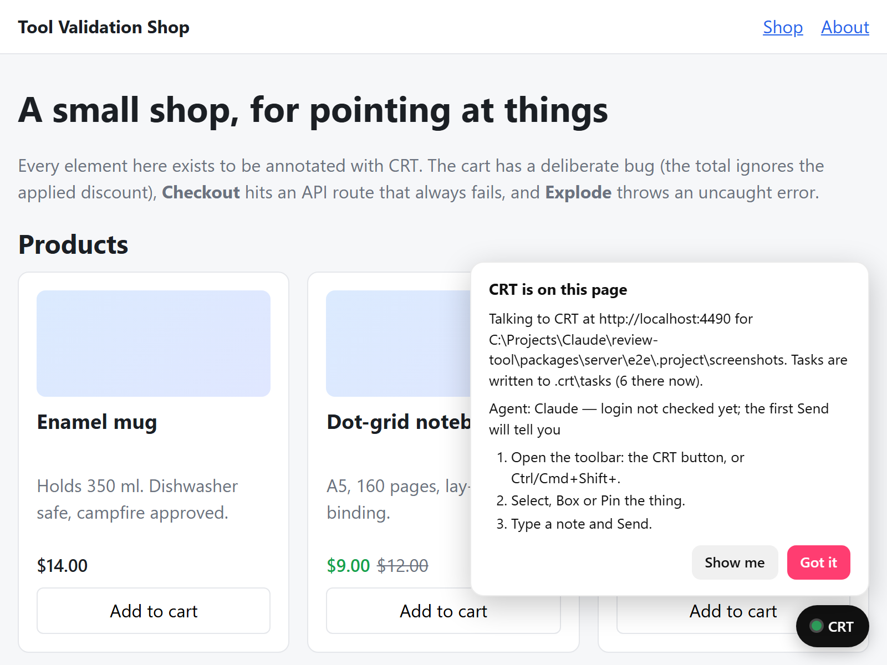
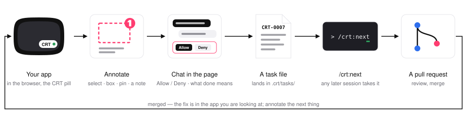
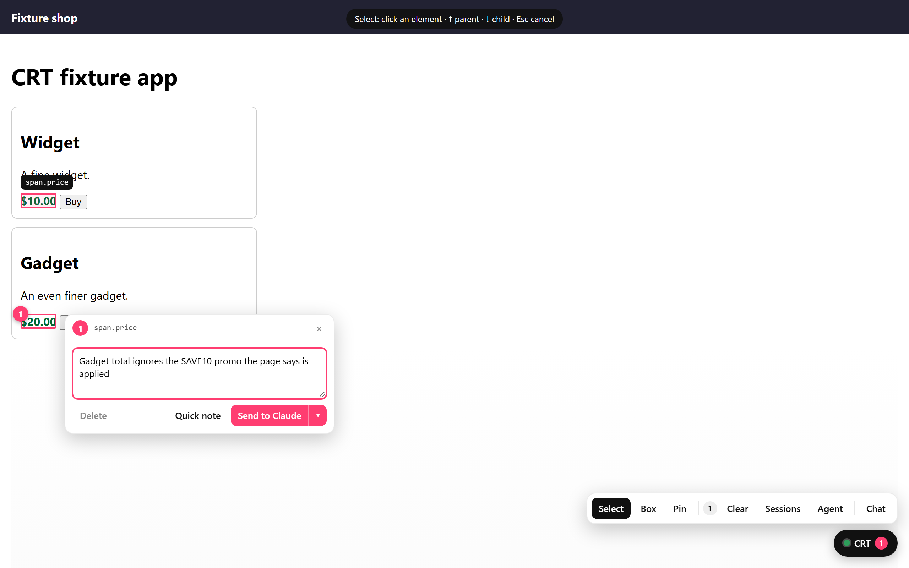
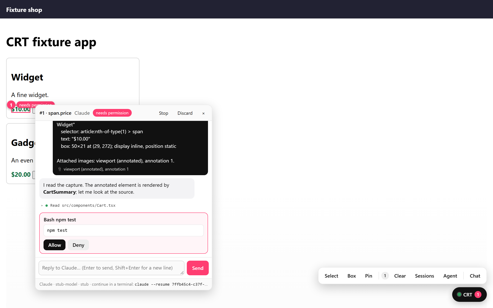
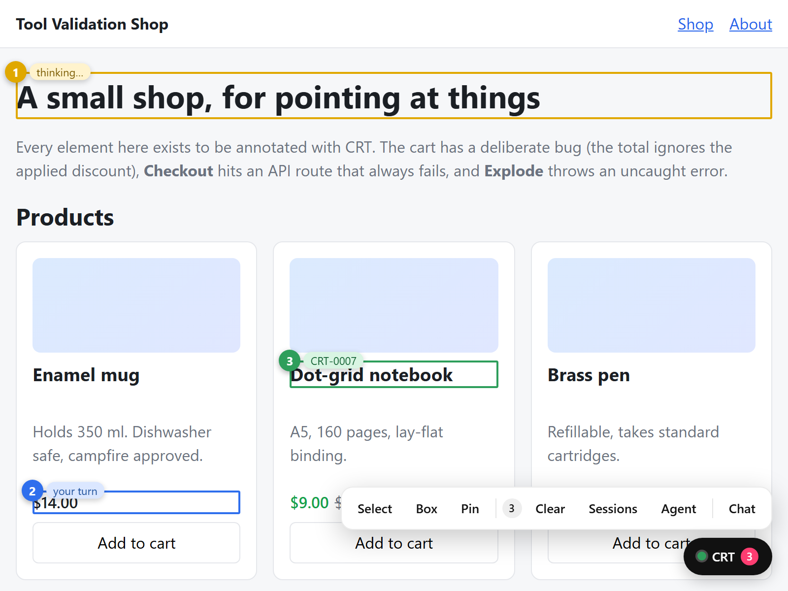
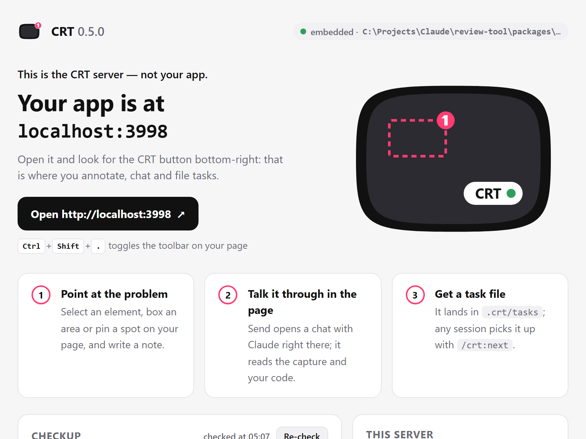

# Claude Review Tool (CRT)

Annotate your local site in the browser, talk to Claude in the page, and get a self-contained task file in your repo that any Claude Code session can pick up later with `/crt:next`. CRT started as Claude-only; since v0.2 it also works with Codex, since v0.5 with Gemini CLI and any Agent Client Protocol agent (both experimental — see Providers) and with the Antigravity CLI, and Claude Code remains the default. The name is historical.

> v0.5.0. [docs/PRD.md](docs/PRD.md) defines the scope, requirement IDs (F-n, N-n) and the definition of done; [docs/PRD-providers.md](docs/PRD-providers.md) (v0.2, providers), [docs/PRD-setup.md](docs/PRD-setup.md) (v0.3, setup and first run), [docs/PRD-embedded.md](docs/PRD-embedded.md) (v0.4, embedded mode) and [docs/PRD-polish.md](docs/PRD-polish.md) (v0.6, polish) amend it; v0.5 ships PRD-providers M10 (Gemini CLI and any ACP agent, experimental). This README is the front page; the manual is [`docs/`](#docs).

<p align="center">
  <picture>
    <source media="(prefers-color-scheme: dark)" srcset="docs/brand/crt-lockup-dark.svg">
    
  </picture>
</p>



## Install

```bash
# one-time, per machine
npm i -g claude-review-tool
crt setup                         # registers the bundled plugin with Claude Code: /crt:init, /crt:serve, /crt:next, …

# one-time, per project
crt init                          # .crt/ (README, tasks, config), 2 .gitignore lines, a CRT section in CLAUDE.md — each announced,
                                  # then it prints the one-line snippet for your framework; /crt:init in Claude Code applies it for you

# per session
npm run dev                       # your dev server, your URL
crt                               # CRT server on :4400; opens your app; the CRT button is on your page
```

`crt init` sets a project up once, saying what it will write before it writes it (see [What lands in your repo](#what-lands-in-your-repo)), and ends with the snippet for your framework; the next section has all four forms. Install the package in the project too (`npm i -D claude-review-tool`) so the snippet's import resolves — the script-tag form needs no package.

Node ≥ 20 on Windows, macOS or Linux; Claude Code installed and logged in (`claude` → `/login`) — no API key, CRT reuses that login. What `crt setup` installs, the other ways to install (in the lockfile, zero-install `npx`, from GitHub), the Windows note and older task files: [docs/install.md](docs/install.md).

## Add CRT to your app

One dev-only line in the app puts the CRT button on the app's own URL: the line loads a small loader from the running CRT server, and the loader puts the overlay on the page. `crt init` prints the form for your framework (`/crt:init` in Claude Code applies it); these are the four:

```tsx
// Next.js (App Router) — app/layout.tsx
import { CrtDevTools } from "claude-review-tool/react";
…
<body>{children}<CrtDevTools /></body>
```

```ts
// Vite — vite.config.ts
import { crt } from "claude-review-tool/vite";
export default defineConfig({ plugins: [react(), crt()] });
```

```ts
// any bundled app — the client entry (src/main.tsx, src/index.ts, …)
import { mountCrt } from "claude-review-tool/loader";
if (process.env.NODE_ENV !== "production") mountCrt();   // the guard is optional (F-98); it lets the bundler drop the import
```

```html
<!-- no bundler — the development page only -->
<script src="http://localhost:4400/__crt/loader.js"></script>
```

The Vite plugin starts capturing console errors and failed requests before the app's first module, `<CrtDevTools />` after hydration, `mountCrt()` from wherever you call it, and the script tag from the tag onward. The loader itself, its options (`{ port }`, `data-crt-port`), the pill it shows while `crt` is not running and the plain overlay tag: [docs/integration.md](docs/integration.md).

## The loop

```bash
cd my-app && npm run dev     # your dev server, e.g. http://localhost:3000
crt                          # the CRT server on http://localhost:4400; opens your app — the CRT button is on your page
```

<picture>
  <source media="(prefers-color-scheme: dark)" srcset="docs/images/loop-dark.svg">
  
</picture>

Inside Claude Code, `/crt:serve` does what `crt` does — it reuses a CRT that is already serving the project, offers `/crt:init` first when the project is not set up, and replies with four lines saying where CRT is, where tasks go, which agent answers and what to click next.

1. **Browse your app as usual** — `http://localhost:3000`, your own URL, no proxied copy. A **CRT** button sits in the bottom-right corner (drag it anywhere; `Ctrl/Cmd+Shift+.` toggles it). Its dot says how things stand — hover it: green is connected (which project, which agent, whether it is logged in), amber means the agent is not ready (the fix is in the tooltip), red means the CRT server stopped answering. On a project’s first visit a small card above the button says which CRT server the page talks to (`Talking to CRT at http://localhost:4400 for C:\my-app.`), where tasks go and which agent will answer; **Got it** dismisses it for that project, **Show me** opens the toolbar with Select armed.
2. **Point at the problem.** Open the toolbar and pick a tool:
   - **Select** — hover shows an outline and a label (tag, id/classes, and the React/Vue component name when detectable); click pins the element. `↑` moves to the parent, `↓` to the first child, `Enter` pins, `Esc` cancels.
   - **Box** — drag a rectangle; the elements inside it are recorded.
   - **Pin** — click a point with no element ("something is missing here").
   Each annotation gets a number and a popover beside the element with its note. Add as many as you like; **Delete** one from its popover, **Clear** drops them all. They survive in-page navigation and a reload, and clicking a number badge reopens its popover.



3. **Send to Claude** — the button in the popover. The overlay captures the page and the same popover becomes the chat. Claude — a real Claude Code session with `cwd` set to your project, with your `CLAUDE.md`, settings, plugins and MCP servers loaded — reads the capture and your code, asks at most a couple of questions only if it has to, proposes a definition of done, and on your OK writes `.crt/tasks/CRT-0007-<slug>.md` with the screenshots under `.crt/tasks/assets/CRT-0007/`. The marker stays on the page: its badge takes the session's colour and a pill next to it says `thinking…`, `needs permission`, `your turn` or the task ID, so you can close the popover, annotate something else and start a second thread while the first is still working. Each thread has its own popover; one is open at a time.
   - Sending captures that one annotation. Tick **include the N other unsent annotations** in the popover to send several as one capture ("these two should match").
   - **Quick note** instead of Send, when the note is written: the popover closes and Claude writes the task on its own. The status line shows the task ID when it lands; the popover opens by itself only if Claude has a question or needs a permission.
   - **Chat** in the toolbar starts a conversation about the page as a whole — no element, just your message plus the screenshot, console and failed requests. It docks above the toolbar, and the Chat button shows its state.
   - **Sessions** lists the recent intake sessions (note, state, task ID) so you can reopen one — for example a quick note that turned into a question while you were browsing elsewhere.
   - Tool use shows as collapsed lines; anything not pre-allowed (reads, searches, read-only `git`, writes under `.crt/`) asks you in the popover with **Allow / Deny** (if you are busy in another popover, the marker pulses and the status line points at it instead). **Stop** interrupts the turn; **Discard** closes the session and removes the annotation; **×** just hides the popover. The footer shows the session ID and `claude --resume <id>` to continue the same conversation in a terminal.





4. **Later, in any session on that project:**

```
/crt:tasks           # what's outstanding
/crt:next            # pick the next backlog task and take it to a PR, without stopping
/crt:next CRT-0007   # work (or retry) a specific task
/crt:task CRT-0007   # show one task and the next action for it
/crt:done CRT-0007   # after the PR merges: mark it done, record the PR URL
```

`/crt:next` claims the task (`status: in_progress`, log entry, branch `crt/CRT-0007-<slug>`), implements the **Ask**, ticks each **Definition of Done** item it verified, runs the project's tests/lint/build, sets `status: review`, commits, pushes and opens a PR whose body is the task's Summary + DoD + a link to the task file. It never asks you anything: if the task file is not enough to proceed it sets `status: blocked` with the question in the **Log** — answer it under **Notes** and run `/crt:next CRT-0007` again. Merging is yours.

If you open `http://localhost:4400` itself instead of your app, you get CRT's status page: where your app is, anything `crt doctor` would flag with the fix beside it, this server's facts and the three steps above — served from the CRT origin only, nothing fetched from anywhere else.



Every command and flag, what `crt` prints on the way to `CRT ready`, and what Claude gets at Send time: [docs/cli.md](docs/cli.md). The task file: [docs/task-format.md](docs/task-format.md). The pieces and how they talk: [docs/how-it-works.md](docs/how-it-works.md).

## Production

Nothing from CRT ships in a production build: the package's `production` export condition maps the entries to no-op modules, every entry's body sits behind `process.env.NODE_ENV !== "production"`, the loader does nothing off a loopback hostname, and the Vite plugin is `apply: "serve"`.
Verify any build with `grep -r "__crt" dist/` (or `.next/static`) — it finds nothing; the four layers and the verified bundlers are in [docs/integration.md › Production](docs/integration.md#production).

## What lands in your repo

`crt init` writes these, and prints its plan before writing anything (`crt init will, in <root>:` followed by one line per item not already in place):

- `.crt/README.md` — what the folder is, for people reading it on GitHub. Written once; hand-editable.
- `.crt/tasks/` — the task files (`CRT-NNNN-<slug>.md`), their `assets/<ID>/` screenshots and the generated `README.md` index. Committed.
- `.crt/config.json` — per project, committed: `mode`, `target`, `port`, `provider`.
- two `.gitignore` lines — `.crt/captures/` (transient captures) and `.crt/config.local.json` (per machine: the remembered target, the remembered provider).
- a CRT section in `CLAUDE.md` and `AGENTS.md` (whichever exist; one is created when neither does) between `<!-- BEGIN:crt v0.5 -->` and `<!-- END:crt -->`, so the project's agents know what `.crt/tasks/*.md` are, that they appear during intake, and that they are committed with the project — never deleted or "cleaned up". Re-running `crt init` replaces the section in place; `--no-instructions` skips it.

That is the complete list. At runtime the server (`crt`, `crt serve`, `crt proxy`) writes only under `.crt/` — captures, tasks, the index, `config.local.json` — and never touches `.gitignore`, `CLAUDE.md`, `AGENTS.md` or any app file; `crt init` is the one command that writes outside `.crt/`, and it names every file on stdout as it does (the other explicit CLI writes are `crt skills install`, into `.agents/skills/`, and `crt setup`, into Claude Code's own plugin store).

## Providers

The agent behind the in-page chat is a *provider*: Claude Code unless you say otherwise — `crt --provider <id>`, `provider` in `.crt/config.json`, or the caret next to **Send** for one send. `crt providers` prints every provider's state and which one a new session would use, with the reason.

| Agent | Status | Install | Login |
|---|---|---|---|
| Claude Code | the default | Claude Code itself (`npm i -g @anthropic-ai/claude-code`); CRT bundles the Agent SDK's own binary | `claude` → `/login`, or `CLAUDE_CODE_OAUTH_TOKEN` |
| Codex CLI | tested with `codex-cli 0.154.0` | `npm i -g @openai/codex` | `codex login` |
| Gemini CLI | experimental — the driver is complete, never run against a real Gemini | `npm i -g @google/gemini-cli` | `GEMINI_API_KEY` in `~/.gemini/.env` (0.60.0 refuses the free Google login) |
| Antigravity CLI | built from real runs of `agy` 1.2.7 | [antigravity.google/docs/cli](https://antigravity.google/docs/cli) | `agy` → sign in |
| Any ACP agent | experimental — tested against a fake agent | `provider: { "kind": "acp", "command": … }` in `.crt/config.json` | the agent's own |

Per provider — what a session looks like, telemetry, skills, every problem line and what it means: [docs/providers.md](docs/providers.md).

## Troubleshooting

Run `crt doctor` first. It is a read-only checklist — one row per check, `ok` / `warn` / `FAIL` / `--` as words, exit 1 on any `FAIL`, nothing but localhost probes — and its rows name the fix:

```
$ crt doctor
ok    node      v22.4.0 (needs 20 or newer)
ok    project   C:\my-app (.git)
ok    .crt      README.md, tasks/ (4 tasks), config.json, config.local.json, .gitignore entries
ok    mode      embedded
ok    target    http://localhost:3100 (remembered) — responding
ok    integration next — app/layout.tsx imports claude-review-tool/react
ok    instructions CLAUDE.md carries the CRT section
ok    port      4400 free
ok    claude    Claude Code (Agent SDK 0.3.270) — logged in
warn  codex     codex-cli 0.154.0 — not logged in — run `codex login`
ok    plugin    crt@crt 0.5.0 installed (claude on PATH)
→ claude — codex not logged in
```

Every failure is one `crt:` line on stderr and a non-zero exit; the catalogue — each line and each doctor row, what it means and the fix — is in [docs/troubleshooting.md](docs/troubleshooting.md).

## Docs

| Page | What |
|---|---|
| [docs/install.md](docs/install.md) | what `crt setup` installs, the other ways to install, the Windows note, older task files |
| [docs/integration.md](docs/integration.md) | the four forms and where each starts capturing, the loader and its options, Production in full, proxy mode |
| [docs/cli.md](docs/cli.md) | every command and flag, what `crt` prints, what Claude gets at Send time |
| [docs/providers.md](docs/providers.md) | Claude Code, Codex, Gemini CLI, Antigravity CLI and any ACP agent — sessions, login, telemetry, skills, every problem line |
| [docs/task-format.md](docs/task-format.md) | the task file: frontmatter, the seven sections, the bar it holds itself to |
| [docs/how-it-works.md](docs/how-it-works.md) | the pieces, embedded and proxy mode, the overlay, the intake session, permissions, privacy |
| [docs/troubleshooting.md](docs/troubleshooting.md) | every `crt doctor` row and every `crt:` line, what it means and the fix |
| [docs/develop.md](docs/develop.md) | build, test, release, the repository layout, the PRDs |

## Repository

| Path | What |
|---|---|
| `packages/server` | npm package `claude-review-tool` — the `crt` CLI, the CRT server (embedded and proxy modes), capture store, session manager, the `claude-review-tool/{react,vite,loader}` entries; its `dist/plugin-marketplace/` is the plugin as `crt setup` installs it |
| `packages/overlay` | in-page UI and the loader, bundled into the server |
| `plugin/` | the Claude Code plugin (skills + hooks); marketplace manifest at `.claude-plugin/marketplace.json` |
| `docs/` | the reference pages above, the product requirements documents (`PRD.md`, `PRD-providers.md`, `PRD-setup.md`, `PRD-embedded.md`, `PRD-polish.md`), the design review, the spikes, the brand files and the images |
| `.crt/tasks` | this repo's own work items, in CRT's task format |

## Develop

`npm ci`, then `npm run check` (typecheck, unit tests, build) and `npm run e2e` (Playwright smoke; `npx playwright install chromium` once). Plugin changes must pass `claude plugin validate ./plugin`; CI runs both. The release recipe, `npm run screenshots` and the PRDs: [docs/develop.md](docs/develop.md).

License: MIT.
