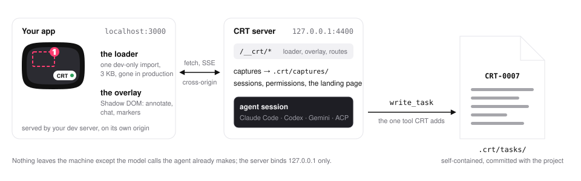

# docs/images

The pictures the README and the docs embed: five screenshots that one command regenerates, and two illustrations drawn by hand (PRD-polish §5.3, F-116, F-117, N-27).

## The screenshots

| File | Shows |
|---|---|
| `arrival.png` | The shop page with the CRT pill bottom-right and the first-visit welcome card open |
| `select.png` | Select armed: the hover outline and label on a price (the component name first), one pinned marker with its popover and a typed note |
| `chat.png` | The popover as the chat: your note as the first bubble with its `Capture` pill, the streamed text, a collapsed tool line, the permission card (its **Allow / Deny** buttons scrolled just below) |
| `marker-states.png` | Three markers on one page — `thinking…`, `your turn`, `CRT-0007` |
| `landing.png` | The CRT server's landing page (`/`), light |

All five are PNG, light, 800 × 600 CSS px at device pixel ratio 2 (1600 × 1200), each ≤ 400 KB (`packages/server/test/docs-images.test.ts` fails when one is over). They are pictures of the e2e fixture's `/shop` page (`packages/server/e2e/fixture/server.mjs`) — the trial shop from the `tool-validation` app, ported into the fixture with its markup and CSS and rendered with the fixture's React 18 dev build, so the Select label and the chat name the component (`ProductCard`) as they do on the real app — with the real overlay talking to a real embedded `crt serve` whose agent is the scripted stub (`CRT_SESSION_STUB=1`), so the product in them is the overlay, not the app behind it. The stub names the component and source file the page reports; on a page without component detection it says `CartSummary` / `src/components/Cart.tsx`.

### Regenerate

```bash
npm run build && npm run screenshots
```

`npm run screenshots` runs `packages/server/e2e/screenshots.spec.ts` under `packages/server/playwright.screenshots.config.ts`: it starts the fixture app on :3998 and a `CRT_SESSION_STUB=1` embedded CRT server on :4490 from the scratch project `packages/server/e2e/.project/screenshots/` (gitignored), drives the overlay to each state through `window.__crt` and the page (the markers sit on the heading, the mug's price and the notebook's name or sale price — the elements above the fold and clear of the toolbar at 600 px), and writes the five files here. It needs `npx playwright install chromium` once, like `npm run e2e`. It is not part of `npm run e2e` and never runs in CI: pixel diffs flake, so CI only checks that the files exist and are under budget.

Determinism (N-27): the config pins the viewport, the DPR, the light colour scheme, the locale and time zone and one worker in file order; each image gets a fresh browser context (no storage carried over) and a fake clock started at one fixed instant; the scratch project's `.crt/tasks` is reset to six placeholders before the first image, so the task the stub writes is always `CRT-0007`; every capture is taken with animations disabled after a wait on the overlay's own signals (`data-health`, the marker's state, the popover's elements, the transcript's scroll), never a fixed sleep. Re-running on the same machine reproduces `arrival.png`, `select.png` and `marker-states.png` pixel for pixel, `chat.png` up to the session id in the popover footer, and `landing.png` up to its two clock readings. What the script cannot pin and a reviewer's run will differ in:

- font rasterisation (another OS or Chromium build);
- the session id in the chat footer (`chat.png`) and the capture id in the first message — the server mints them per session;
- the project path — the scratch project's absolute path in the welcome card (`arrival.png`) and on the landing page;
- the fixture's port in the welcome card and on the landing page (`localhost:3998`), if the config's `FIXTURE_PORT` changes;
- the landing page's `checked at` time, `Up since`, Node version, plugin row and which providers are installed and logged in on the machine (`landing.png`).

**Never hand-edit a PNG**: run the command and commit what it writes. When the overlay changes, re-run before a release (the Release line in `CLAUDE.md`).

## The illustrations

| File | Shows |
|---|---|
| `loop.svg`, `loop-dark.svg` | The loop: your app in the browser with the pill → annotate (the badge) → chat in the page → a task file → `/crt:next` → a pull request, and one arrow back |
| `architecture.svg`, `architecture-dark.svg` | How it fits together: your app on its own origin with the loader and the overlay ⇄ the CRT server on `127.0.0.1:4400` → the agent session → `write_task` → `.crt/tasks/` |

Hand-drawn SVG on the brand geometry (`docs/brand/`: the tube for the browser, the pill for the button, the badge for annotations), ≤ 10 KB each. GitHub renders SVG through `` — no page CSS, and `currentColor` is black — so every colour is fixed in the file (no `currentColor`, no CSS variables, no `<style>`) and each drawing has a light file and a dark file, embedded through `<picture>` with `prefers-color-scheme`, as here:

<picture>
  <source media="(prefers-color-scheme: dark)" srcset="loop-dark.svg">
  
</picture>

<picture>
  <source media="(prefers-color-scheme: dark)" srcset="architecture-dark.svg">
  
</picture>

The palette is the landing page's (`packages/server/src/landing.ts`) over the overlay's tokens (`packages/overlay/src/tokens.ts`); text is `system-ui` with a generic fallback. Edit them by hand; keep the light and dark files the same drawing.
